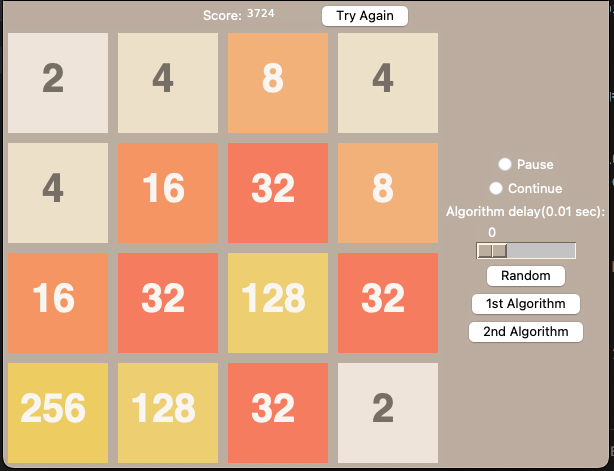

# 2048 Game

My second project that I decided to build. At the time I was still a novice programmer and I was fascinated with game development. That was the motivation for building my first game (a copy of minesweeper) and was the motivation for building this second game (a copy of 2048).

The game runs pretty smoothly and works just as the original version did. I was also intrigued by the idea of using AI in games and so I added these algorithms that play the game as well. These algorithms are in fact not AI but just straight algorithms, which is why they are named as such. However, it was fun to try and develop a strategy to win the game that only relies on an algorithm.

The game looks like this:

